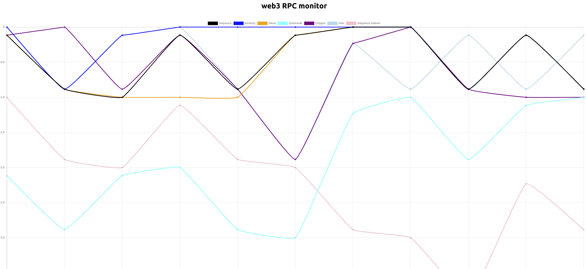

# web3-rpc-monitor
Updates a graph every 2 seconds to show a comparison across 6 RPC endpoints the difference in max block number

## retroactive tracking
- hold a db or in-memory variable of last X blocks (7 days)
- look into percentage of blocks of the last X blocks (or 7 days) that is behind the max
- view a last day of data (static)
